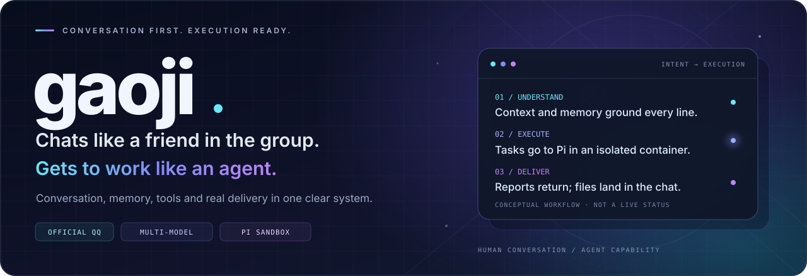
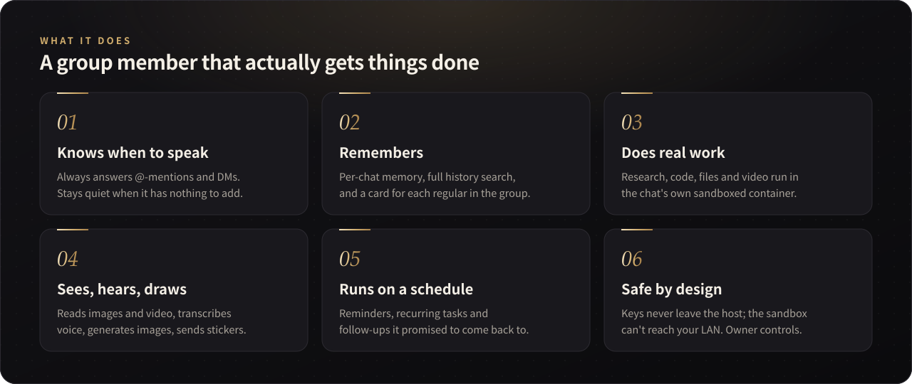
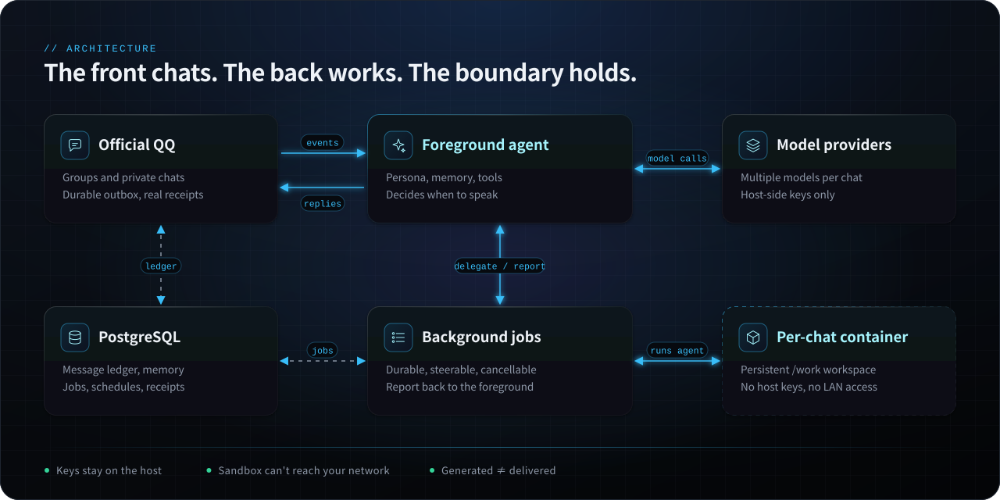

<p align="center">
  
</p>

<p align="center">
  <strong>English</strong> &nbsp;·&nbsp; <a href="README.zh-CN.md">简体中文</a>
</p>

<p align="center">
  <a href="https://github.com/zty20040403/gaojibot/actions/workflows/ci.yml"></a>
  
  
  
  <a href="LICENSE"></a>
  <a href="https://github.com/zty20040403/gaojibot/stargazers"></a>
</p>

<p align="center">
  <b>gaoji</b> is an AI member for your QQ group that talks like a person and works like an agent.<br />
  It answers when you @ it, stays quiet when it has nothing to add, remembers the group,<br />
  and hands real work to a coding agent in the chat's own sandboxed container.
</p>

<p align="center">
  <a href="#highlights">Highlights</a> &nbsp;·&nbsp;
  <a href="#how-it-works">How it works</a> &nbsp;·&nbsp;
  <a href="#quick-start">Quick start</a> &nbsp;·&nbsp;
  <a href="#deploy-with-nixos">NixOS</a> &nbsp;·&nbsp;
  <a href="#security">Security</a> &nbsp;·&nbsp;
  <a href="#documentation">Docs</a>
</p>

<br />

<a id="highlights"></a>
<p align="center">
  
</p>

### Why gaoji

|  | A typical chat bot | **gaoji** |
| :--- | :--- | :--- |
| **When it talks** | Replies to everything, or only to commands | Always answers @-mentions and DMs; otherwise speaks only when it has something useful |
| **Memory** | The last few messages | Per-chat memory, full history search, a card for each regular, tidied regularly |
| **Long tasks** | Blocks the chat or times out | Durable background jobs you can check on, steer or cancel while you keep chatting |
| **Where code runs** | On the bot's host, or nowhere | In the chat's own NixOS container with a persistent `/work`, no host keys, no LAN |
| **Delivery** | Fire and forget | A durable outbox with real platform receipts — *generated* is never counted as *delivered* |
| **Models** | One provider | Multiple providers, chosen per conversation |

### What it looks like in practice

| You say | gaoji does |
| :--- | :--- |
| *"Compare RAM prices this month, chart + CSV please."* | Says it has started → a background job searches and processes the data → posts the conclusion with sources, plus the files. |
| *"What is this video about?"* | Imports the attachment → samples frames and transcribes the audio in the sandbox → replies with a summary. |
| *"Also add the other model to that."* | Finds the running job and steers it instead of starting a second one. |
| *"Remind me about the meeting at 3 pm tomorrow."* | Creates a one-off reminder and delivers it on time. |

<sub>Examples of flows, not screenshots. Real results depend on the model, host configuration and the permissions QQ grants.</sub>

<a id="how-it-works"></a>
## How it works

<p align="center">
  
</p>

- **Foreground** — official QQ events → timeline and memory → multi-model agent → one durable delivery path.
- **Background** — durable jobs → the host drives a coding agent → `/work` in the chat's container → the report wakes the foreground, which delivers it in the same voice.
- **State** — PostgreSQL holds the message ledger, memory, jobs, schedules and delivery receipts.

<a id="quick-start"></a>
## Quick start

**Requirements:** Python 3.12+, [uv](https://docs.astral.sh/uv/), PostgreSQL 17 with pgvector, official QQ bot credentials and a model API. For files, browser and video, use a Linux host with KVM.

```sh
git clone https://github.com/zty20040403/gaojibot.git
cd gaojibot
uv sync --locked
cp .env.example .env          # database, models, QQ credential file paths
uv run python -m src.bot_storage.cli upgrade
uv run python bot.py
```

| Configure | Where |
| :--- | :--- |
| Database, models, persona, search, sandbox, background jobs | [`.env.example`](.env.example) |
| Connecting and binding the official QQ bot | [Official QQ integration](docs/qq-official.md) |
| Files, media and proactive replies | [Host configuration](docs/qq-official-host-config.md) |

> [!IMPORTANT]
> The AppID, AppSecret and binding pepper are read from `0600` files on the host. Never commit secrets, real QQ numbers, openids or group numbers, and never copy credentials into the sandbox.

<a id="deploy-with-nixos"></a>
## Deploy with NixOS

The flake ships the package and `nixosModules.default`.

```nix
services.gaoji = {
  enable = true;
  environmentFile = "/run/secrets/gaoji.env";
  qqOfficial = {
    enable = true;
    appIdFile = "/run/secrets/qq-app-id";
    appSecretFile = "/run/secrets/qq-app-secret";
    bindPepperFile = "/run/secrets/qq-bind-pepper";
    hostConfigFile = "/run/secrets/qq-host.json";
  };
};
```

Per-chat workspaces run as NixOS containers (`systemd-nspawn`) and need `sandbox.enable = true`, `sandbox.vmRoot`, `systemd.network.enable = true` and `networking.nftables.enable = true`. Container root filesystems are rebuilt from the module on restart; `/work` persists. Read [Container sandbox](docs/container-sandbox.md) before going live.

<a id="security"></a>
## Security

- **Keys stay on the host.** QQ credentials, model keys and operations credentials never enter the sandbox; it only gets revocable, conversation-scoped tokens.
- **The sandbox can't reach your network.** Only the public internet, DNS and the relay ports are allowed — not the host, not the LAN.
- **People stay in charge.** Group owners and admins can `/stop`, `/start` and `/kill` the bot in their chat; the admin console shows chats, usage, jobs and audits.
- **Generated is not delivered.** A finished job, an uploaded file, a queued message and a platform receipt are tracked as separate stages.

More in [Sandbox security](docs/sandbox-security.md).

<a id="documentation"></a>
## Documentation

| I want to know… | Start here |
| :--- | :--- |
| How QQ is connected, bound and sent to | [Official QQ integration](docs/qq-official.md) |
| How files, media and proactive replies are enabled | [Host configuration](docs/qq-official-host-config.md) |
| Why the sandbox can't reach the host or LAN | [Sandbox security](docs/sandbox-security.md) |
| How per-chat workspaces run | [Container sandbox](docs/container-sandbox.md) |
| Why things are designed the way they are | [Architecture decisions](docs/adr/) |

<sub>Most in-depth documents are currently written in Chinese.</sub>

<details>
<summary><strong>Development</strong></summary>

```sh
# Set GAOJI_TEST_PASSWORD for the local PostgreSQL test container first.
source tools/dev/testenv.sh gaoji_test
python -m unittest discover -s tests -p 'test_*.py'
ruff check bot.py src tests tools migrations nix
python tools/dev/check_unresolved_imports.py src
cd admin-ui && npm ci && npm run build
```

Tests use a separate local database and never production credentials. Read [AGENTS.md](AGENTS.md) before contributing: one change per PR, and features are accepted on real behaviour — a simulated receipt is not a delivery.

</details>

## Star history

<p align="center">
  <a href="https://star-history.com/#zty20040403/gaojibot&amp;Date">
    <picture>
      <source media="(prefers-color-scheme: dark)" srcset="https://api.star-history.com/svg?repos=zty20040403/gaojibot&amp;type=Date&amp;theme=dark" />
      
    </picture>
  </a>
</p>

<p align="center">
  If gaoji made your group chat a little smarter, a ⭐ helps others find it.
</p>

---

<p align="center">
  <sub>Built by Kenneth · <a href="LICENSE">MIT License</a> · <a href="https://github.com/zty20040403/gaojibot/issues">Issues &amp; ideas</a></sub>
</p>
